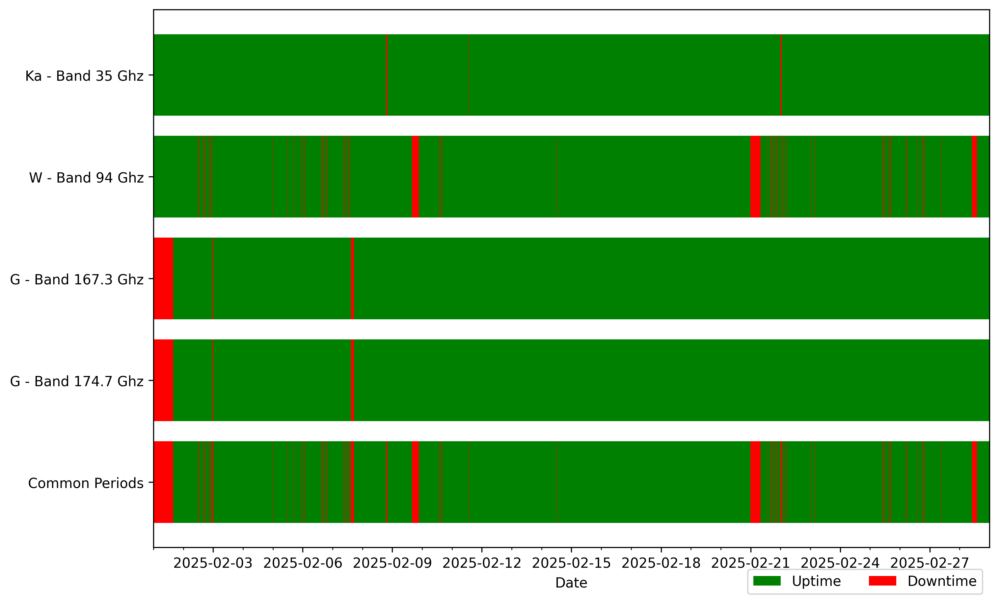
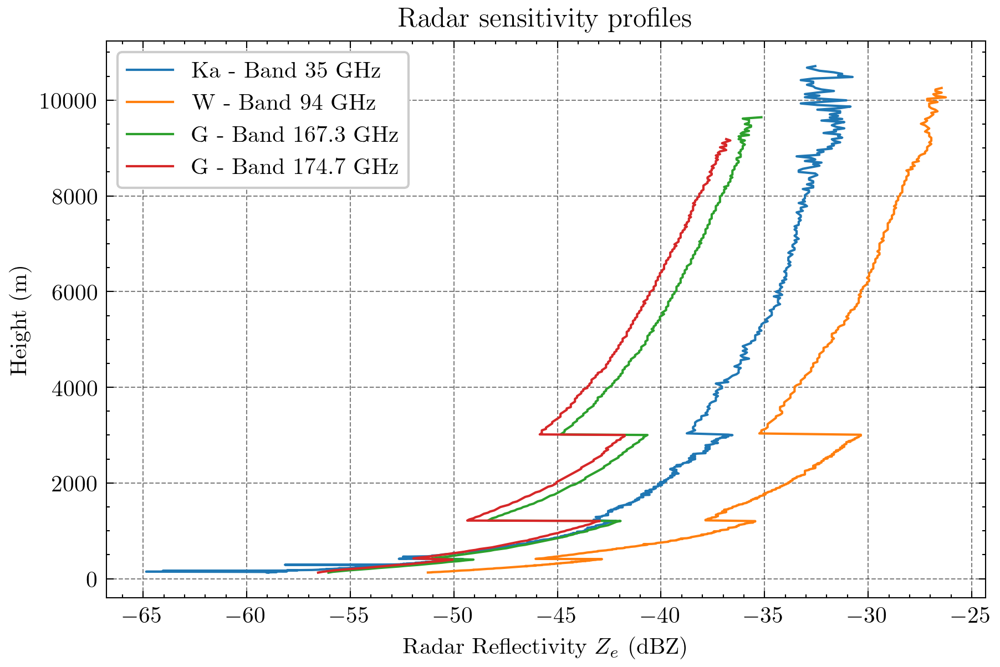
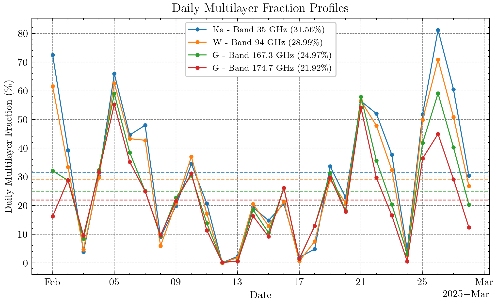
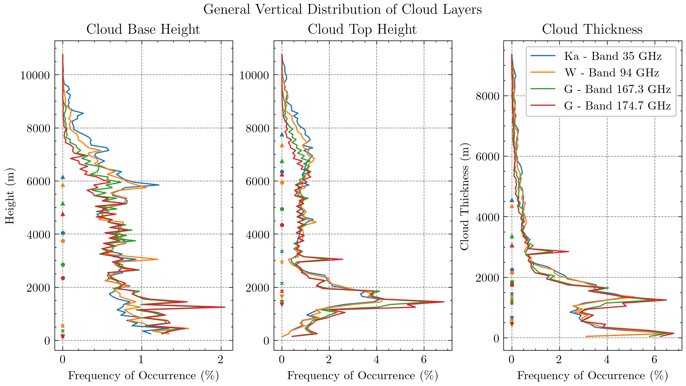

# Cloud Radar Processing & Comparison

This project processes multi-radar cloud NetCDF data and compares all radars on a common time/height basis.
Running `main.py` does preprocessing, aligning multi-radar data to a common time/height basis, cloud-layer detection, statistics, and plotting.

The output in `output/figures` includes:
- an overview of up- and downtimes of the given radars and their common up- and downtimes
- estimated radar sensitivty during the specified campaign range
- daily fractions for the following scenarios:
   - clear sky
   - cloudiness
   - precipitation (relative to cloudiness)
   - multilayer
   - vertical cloud fraction
- vertical distributions for:
   - cloud layers
   - a general all layers distribution
   - a per layer overview

All examples are found in `docs/assets/`. Here only a few examples are shown:





## What happens when you run `main.py`

1. Load configuration from:
   - `settings/radar_settings.json`
   - `settings/dataset_settings.json`
   - `settings/parameter_settings.json`
2. Load radar files for the configured campaign window and preprocess each radar dataset:
   - collect files from date folders,
   - sort/check time axis,
   - keep configured variables,
   - optionally convert linear Ze to dBZ,
   - rename dimensions/variables to a common naming scheme.
3. Compute reflectivity occurrences and sensitivity profiles for each radar.
4. Clean and align datasets:
   - compute uptime/downtime intervals,
   - keep only common uptime intervals across radars,
   - slice to common vertical range,
   - compute/add range-gate-size information.
5. Run cloud detection per time profile:
   - threshold by fixed dBZ or `sensitivity + offset`,
   - detect cloud base/top edges,
   - merge/split layers using minimum spacing and thickness rules,
   - store layer outputs (`n_layers`, cloud base/top/thickness in gates and meters).
6. Compute cloud statistics:
   - daily clear-sky/cloudiness/multilayer/precipitation fractions,
   - cloud presence per height gate,
   - binned cloud property distributions,
   - optional NetCDF export of statistics-enhanced datasets (controlled by `write_netcdf_files`).
7. Create plots in the configured figure folder.

## Input data layout

Each radar `data_path` must contain daily subfolders in this format:

```text
<data_path>/YYYY/MM/DD/*.nc
```

Example: `/path/to/radar/2025/02/01/file.nc`

## Settings you need to change

### `settings/radar_settings.json`
Define one object per radar (`nyrad35`, `joyrad94`, etc.).

For each radar:
- `slug`: unique ID used internally.
- `data_path`: root folder containing `YYYY/MM/DD/*.nc`.
- `attributes`: metadata used in logs/plots (`name`, `frequency`, `band`).
- `convert_linear_to_dBZ`: `true` if reflectivity in file is linear and must be converted with `10*log10`.
- `add_to_range`: variable name to add instrument altitude to height (or `false` to skip).
- `vars_to_keep`: list of variables to keep from each file.
- `dimension_names`: source names for `time`, `height`, and reflectivity (`ze`) in that radar file.

### `settings/dataset_settings.json`
- `standard_dimension_names`: common names used after renaming (usually `time`, `height`, `ze`).
- `time_range.start` / `time_range.end`: campaign window to load and analyze.
- `figure_folder`: where PNG outputs are written.
- `files_folder`: output folder for generated NetCDF files when file export is enabled.

### `settings/parameter_settings.json`
- `logging_level`: should be ["DEBUG" or "INFO"]
- `write_netcdf_files`: `true` to save one NetCDF per radar after cloud statistics to `files_folder`; `false` to skip file writing.
- `sensitivity.threshold`: percentile-based sensitivity level (used before cloud detection).
- `sensitivity.min_samples_per_height`: minimum counts needed for a valid sensitivity value at a height.
- `occurrence.bin_size`: reflectivity histogram bin size (dBZ).
- `uptime_alignment.sampling_interval_in_minutes`: interval size used to determine uptime.
- `uptime_alignment.max_sampling_time_in_seconds`: max assumed sample coverage.
- `uptime_alignment.threshold_for_uptime`: minimum uptime fraction for keeping an interval.
- `cloud_detection.use_fixed_threshold`: `true` to use `fixed_threshold_in_dBZ`, else use `sensitivity + sensitivity_add_in_dBZ`.
- `cloud_detection.fixed_threshold_in_dBZ`: fixed cloud-detection threshold (only when enabled).
- `cloud_detection.sensitivity_add_in_dBZ`: offset added to sensitivity profile for cloud detection.
- `cloud_detection.min_cloud_thickness_in_m`: minimum layer thickness per range-gate regime.
- `cloud_detection.min_layer_spacing_in_m`: minimum spacing between neighboring layers per range-gate regime.

Note: the current range-gate logic is implemented for four chirp/range-gate regimes, so the two cloud-detection arrays should match that setup.

## Run

```bash
pip install -r requirements.txt
python main.py
```

## Outputs

By default, figures are written to `output/figures/`, including:
- uptime/downtime overview,
- radar sensitivity profiles,
- daily fraction time series,
- cloud layer distribution.

When `write_netcdf_files` is `true` in `settings/parameter_settings.json`, NetCDF files are also written to `files_folder` as:
- `<radar_slug>_with_statistics.nc`
